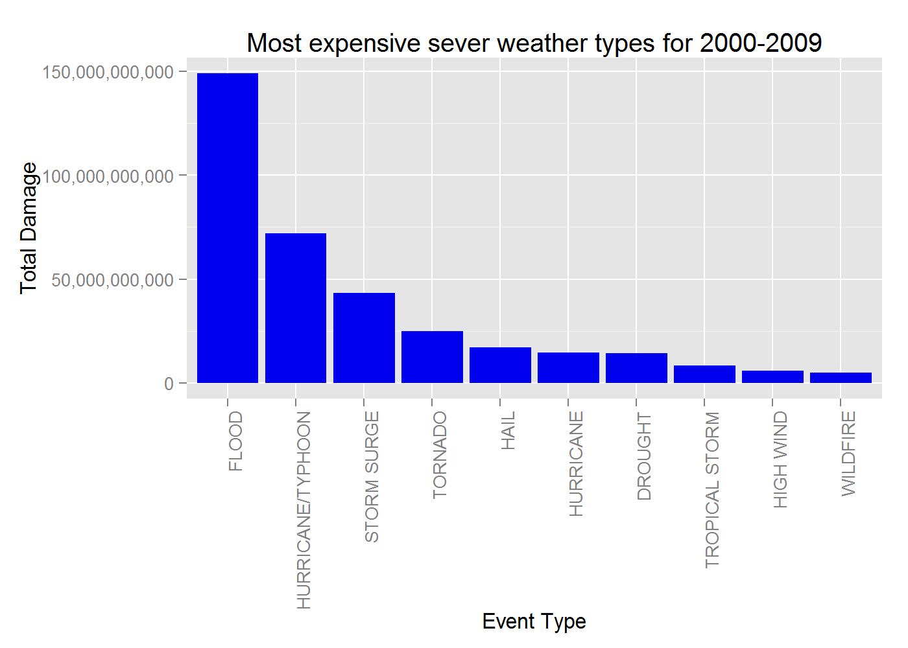
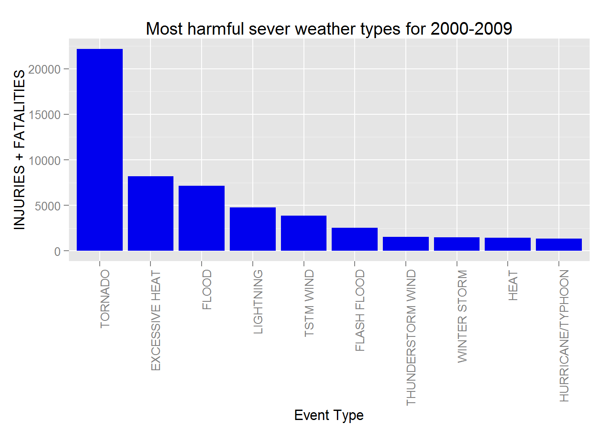

# Reproducible Research Storm Data
Eddie Warner  


## Synopsis:

  
This data analysis will explore the NOAA Storm Database in order to answer questions about severe weather events. This report will look at which event types of most harmful to populations effected. In addition, event types will be analyzed for economic costs.

Since events recorded have changed and coding for events have changed this study will look at the events from 1995 - 2011. This period has all relevent events recorded in the same way. After 1996 48 event types where used to code the events. See [see @NOAA_events] in the reference section below.

## Data Processing


```r
file.name <- "repdata-data-StormData.csv.bz2"
file.url <- "https://d396qusza40orc.cloudfront.net/repdata%2Fdata%2FStormData.csv.bz2"

if(!file.exists(file.name)) {
    download.file(url = file.url, destfile = file.name)
}

storm_data <- as.data.table(read.csv(file.name, stringsAsFactors=FALSE))
```
### Data set facts


```r
dim(storm_data)
```

```
## [1] 902297     37
```

```r
summary(storm_data$EVTYPE, storm_data$BGN_DATE, storm_data$EVTYPE, storm_data$FATALITIES, storm_data$INJURIES, storm_data$PROPDMG, storm_data$PROPDMGEXP, storm_data$CROPDMG, storm_data$CROPDMGEXP)
```

```
##    Length     Class      Mode 
##    902297 character character
```

```r
head(storm_data)
```

```
##    STATE__           BGN_DATE BGN_TIME TIME_ZONE COUNTY COUNTYNAME STATE
## 1:       1  4/18/1950 0:00:00     0130       CST     97     MOBILE    AL
## 2:       1  4/18/1950 0:00:00     0145       CST      3    BALDWIN    AL
## 3:       1  2/20/1951 0:00:00     1600       CST     57    FAYETTE    AL
## 4:       1   6/8/1951 0:00:00     0900       CST     89    MADISON    AL
## 5:       1 11/15/1951 0:00:00     1500       CST     43    CULLMAN    AL
## 6:       1 11/15/1951 0:00:00     2000       CST     77 LAUDERDALE    AL
##     EVTYPE BGN_RANGE BGN_AZI BGN_LOCATI END_DATE END_TIME COUNTY_END
## 1: TORNADO         0                                               0
## 2: TORNADO         0                                               0
## 3: TORNADO         0                                               0
## 4: TORNADO         0                                               0
## 5: TORNADO         0                                               0
## 6: TORNADO         0                                               0
##    COUNTYENDN END_RANGE END_AZI END_LOCATI LENGTH WIDTH F MAG FATALITIES
## 1:         NA         0                      14.0   100 3   0          0
## 2:         NA         0                       2.0   150 2   0          0
## 3:         NA         0                       0.1   123 2   0          0
## 4:         NA         0                       0.0   100 2   0          0
## 5:         NA         0                       0.0   150 2   0          0
## 6:         NA         0                       1.5   177 2   0          0
##    INJURIES PROPDMG PROPDMGEXP CROPDMG CROPDMGEXP WFO STATEOFFIC ZONENAMES
## 1:       15    25.0          K       0                                    
## 2:        0     2.5          K       0                                    
## 3:        2    25.0          K       0                                    
## 4:        2     2.5          K       0                                    
## 5:        2     2.5          K       0                                    
## 6:        6     2.5          K       0                                    
##    LATITUDE LONGITUDE LATITUDE_E LONGITUDE_ REMARKS REFNUM
## 1:     3040      8812       3051       8806              1
## 2:     3042      8755          0          0              2
## 3:     3340      8742          0          0              3
## 4:     3458      8626          0          0              4
## 5:     3412      8642          0          0              5
## 6:     3450      8748          0          0              6
```

### Data conversion

Convert BGN_DATE to a date column to allow for time calculations


```r
storm_data <- storm_data %>% mutate(BGN_DATE = mdy_hms(BGN_DATE))
```

To answer questions implicit to the study the following columns will be selected from the data set. The data set column names are not explicitly listed within either reference documents provided. 


See above. Damage exponent are considered as ("K", "M", "B") thousands, millions and billions.

Create a factor for the cost extension to convert to four levels c("","K", "M", "B").
Calculate a total damage summation between crop damage and infrastructure damage.


```r
sel_storm_data_date <- storm_data %>% filter(BGN_DATE >= ymd("1996/01/01"))
# columns
sel_storm_data_fn <- sel_storm_data_date %>% select(BGN_DATE, EVTYPE, FATALITIES, INJURIES, PROPDMG, PROPDMGEXP, CROPDMG, CROPDMGEXP)
# create factors
sel_storm_data_fn$PROPDMGEXP <- factor(sel_storm_data_fn$PROPDMGEXP, levels=c("","K", "M", "B"))
sel_storm_data_fn$CROPDMGEXP <- factor(sel_storm_data_fn$CROPDMGEXP, levels=c("","K", "M", "B"))
sel_storm_data_fn$EVTYPE <- factor(sel_storm_data_fn$EVTYPE)
# dictionary exp
exp_num <- c(1, 1000, 1000000, 1000000000)
names(exp_num) <- c("","K", "M", "B")

# calculate damage
sel_storm_data_fn <- sel_storm_data_fn %>% mutate(PROPTOT = exp_num[PROPDMGEXP] * PROPDMG)
sel_storm_data_fn <- sel_storm_data_fn %>% mutate(CROPTOT = exp_num[CROPDMGEXP] * CROPDMG)
sel_storm_data_fn <- sel_storm_data_fn %>% mutate(DAMAGETOT = PROPTOT + CROPTOT)
```

Look at the event type column. This 

```r
levels(sel_storm_data_fn$EVTYPE)
```

```
##   [1] "   HIGH SURF ADVISORY"          " COASTAL FLOOD"                
##   [3] " FLASH FLOOD"                   " LIGHTNING"                    
##   [5] " TSTM WIND"                     " TSTM WIND (G45)"              
##   [7] " WATERSPOUT"                    " WIND"                         
##   [9] "ABNORMAL WARMTH"                "ABNORMALLY DRY"                
##  [11] "ABNORMALLY WET"                 "ACCUMULATED SNOWFALL"          
##  [13] "AGRICULTURAL FREEZE"            "ASTRONOMICAL HIGH TIDE"        
##  [15] "ASTRONOMICAL LOW TIDE"          "AVALANCHE"                     
##  [17] "Beach Erosion"                  "BEACH EROSION"                 
##  [19] "BITTER WIND CHILL"              "BITTER WIND CHILL TEMPERATURES"
##  [21] "Black Ice"                      "BLACK ICE"                     
##  [23] "BLIZZARD"                       "Blizzard Summary"              
##  [25] "BLOW-OUT TIDE"                  "BLOW-OUT TIDES"                
##  [27] "BLOWING DUST"                   "blowing snow"                  
##  [29] "Blowing Snow"                   "BRUSH FIRE"                    
##  [31] "COASTAL  FLOODING/EROSION"      "COASTAL EROSION"               
##  [33] "Coastal Flood"                  "COASTAL FLOOD"                 
##  [35] "coastal flooding"               "Coastal Flooding"              
##  [37] "COASTAL FLOODING"               "COASTAL FLOODING/EROSION"      
##  [39] "Coastal Storm"                  "COASTAL STORM"                 
##  [41] "COASTALFLOOD"                   "COASTALSTORM"                  
##  [43] "Cold"                           "COLD"                          
##  [45] "Cold and Frost"                 "COLD AND FROST"                
##  [47] "COLD AND SNOW"                  "Cold Temperature"              
##  [49] "COLD TEMPERATURES"              "COLD WEATHER"                  
##  [51] "COLD WIND CHILL TEMPERATURES"   "COLD/WIND CHILL"               
##  [53] "COOL SPELL"                     "CSTL FLOODING/EROSION"         
##  [55] "DAM BREAK"                      "Damaging Freeze"               
##  [57] "DAMAGING FREEZE"                "DENSE FOG"                     
##  [59] "DENSE SMOKE"                    "DOWNBURST"                     
##  [61] "DRIEST MONTH"                   "Drifting Snow"                 
##  [63] "DROUGHT"                        "DROWNING"                      
##  [65] "DRY"                            "DRY CONDITIONS"                
##  [67] "DRY MICROBURST"                 "DRY SPELL"                     
##  [69] "DRY WEATHER"                    "DRYNESS"                       
##  [71] "DUST DEVEL"                     "Dust Devil"                    
##  [73] "DUST DEVIL"                     "DUST STORM"                    
##  [75] "Early Frost"                    "EARLY RAIN"                    
##  [77] "Early snowfall"                 "EARLY SNOWFALL"                
##  [79] "Erosion/Cstl Flood"             "Excessive Cold"                
##  [81] "EXCESSIVE HEAT"                 "EXCESSIVE HEAT/DROUGHT"        
##  [83] "EXCESSIVE RAIN"                 "EXCESSIVE RAINFALL"            
##  [85] "EXCESSIVE SNOW"                 "EXCESSIVELY DRY"               
##  [87] "Extended Cold"                  "Extreme Cold"                  
##  [89] "EXTREME COLD"                   "EXTREME COLD/WIND CHILL"       
##  [91] "EXTREME WIND CHILL"             "EXTREME WINDCHILL"             
##  [93] "EXTREME WINDCHILL TEMPERATURES" "EXTREMELY WET"                 
##  [95] "FALLING SNOW/ICE"               "FIRST FROST"                   
##  [97] "FIRST SNOW"                     "FLASH FLOOD"                   
##  [99] "FLASH FLOOD/FLOOD"              "FLASH FLOODING"                
## [101] "Flood"                          "FLOOD"                         
## [103] "Flood/Flash Flood"              "FLOOD/FLASH/FLOOD"             
## [105] "Flood/Strong Wind"              "FOG"                           
## [107] "Freeze"                         "FREEZE"                        
## [109] "Freezing drizzle"               "Freezing Drizzle"              
## [111] "FREEZING DRIZZLE"               "Freezing Fog"                  
## [113] "FREEZING FOG"                   "Freezing rain"                 
## [115] "Freezing Rain"                  "FREEZING RAIN"                 
## [117] "FREEZING RAIN/SLEET"            "Freezing Spray"                
## [119] "Frost"                          "FROST"                         
## [121] "Frost/Freeze"                   "FROST/FREEZE"                  
## [123] "Funnel Cloud"                   "FUNNEL CLOUD"                  
## [125] "FUNNEL CLOUDS"                  "Glaze"                         
## [127] "GLAZE"                          "gradient wind"                 
## [129] "Gradient wind"                  "GRADIENT WIND"                 
## [131] "GUSTY LAKE WIND"                "GUSTY THUNDERSTORM WIND"       
## [133] "GUSTY THUNDERSTORM WINDS"       "Gusty Wind"                    
## [135] "GUSTY WIND"                     "GUSTY WIND/HAIL"               
## [137] "GUSTY WIND/HVY RAIN"            "Gusty wind/rain"               
## [139] "Gusty winds"                    "Gusty Winds"                   
## [141] "GUSTY WINDS"                    "HAIL"                          
## [143] "Hail(0.75)"                     "HAIL/WIND"                     
## [145] "HARD FREEZE"                    "HAZARDOUS SURF"                
## [147] "HEAT"                           "Heat Wave"                     
## [149] "HEAT WAVE"                      "Heatburst"                     
## [151] "Heavy Precipitation"            "Heavy rain"                    
## [153] "Heavy Rain"                     "HEAVY RAIN"                    
## [155] "Heavy Rain and Wind"            "HEAVY RAIN EFFECTS"            
## [157] "Heavy Rain/High Surf"           "HEAVY RAIN/WIND"               
## [159] "HEAVY RAINFALL"                 "HEAVY SEAS"                    
## [161] "HEAVY SNOW"                     "Heavy snow shower"             
## [163] "HEAVY SNOW SQUALLS"             "Heavy Surf"                    
## [165] "HEAVY SURF"                     "Heavy surf and wind"           
## [167] "HEAVY SURF/HIGH SURF"           "HIGH  SWELLS"                  
## [169] "HIGH SEAS"                      "High Surf"                     
## [171] "HIGH SURF"                      "HIGH SURF ADVISORIES"          
## [173] "HIGH SURF ADVISORY"             "HIGH SWELLS"                   
## [175] "HIGH WATER"                     "High Wind"                     
## [177] "HIGH WIND"                      "HIGH WIND (G40)"               
## [179] "HIGH WINDS"                     "Hot and Dry"                   
## [181] "HOT SPELL"                      "HOT WEATHER"                   
## [183] "HURRICANE"                      "Hurricane Edouard"             
## [185] "HURRICANE/TYPHOON"              "HYPERTHERMIA/EXPOSURE"         
## [187] "Hypothermia/Exposure"           "HYPOTHERMIA/EXPOSURE"          
## [189] "ICE"                            "Ice Fog"                       
## [191] "ICE JAM"                        "Ice jam flood (minor"          
## [193] "ICE ON ROAD"                    "ICE PELLETS"                   
## [195] "ICE ROADS"                      "ICE STORM"                     
## [197] "Ice/Snow"                       "ICE/SNOW"                      
## [199] "Icestorm/Blizzard"              "Icy Roads"                     
## [201] "ICY ROADS"                      "LAKE-EFFECT SNOW"              
## [203] "Lake Effect Snow"               "LAKE EFFECT SNOW"              
## [205] "LAKESHORE FLOOD"                "LANDSLIDE"                     
## [207] "LANDSLIDES"                     "Landslump"                     
## [209] "LANDSLUMP"                      "LANDSPOUT"                     
## [211] "Late-season Snowfall"           "LATE FREEZE"                   
## [213] "LATE SEASON HAIL"               "LATE SEASON SNOW"              
## [215] "Late Season Snowfall"           "LATE SNOW"                     
## [217] "LIGHT FREEZING RAIN"            "Light snow"                    
## [219] "Light Snow"                     "LIGHT SNOW"                    
## [221] "Light Snow/Flurries"            "LIGHT SNOW/FREEZING PRECIP"    
## [223] "Light Snowfall"                 "LIGHTNING"                     
## [225] "LOCALLY HEAVY RAIN"             "Marine Accident"               
## [227] "MARINE HAIL"                    "MARINE HIGH WIND"              
## [229] "MARINE STRONG WIND"             "MARINE THUNDERSTORM WIND"      
## [231] "MARINE TSTM WIND"               "Metro Storm, May 26"           
## [233] "Microburst"                     "Mild and Dry Pattern"          
## [235] "Minor Flooding"                 "MIXED PRECIP"                  
## [237] "Mixed Precipitation"            "MIXED PRECIPITATION"           
## [239] "MODERATE SNOW"                  "MODERATE SNOWFALL"             
## [241] "MONTHLY PRECIPITATION"          "Monthly Rainfall"              
## [243] "MONTHLY RAINFALL"               "Monthly Snowfall"              
## [245] "MONTHLY SNOWFALL"               "MONTHLY TEMPERATURE"           
## [247] "Mountain Snows"                 "MUD SLIDE"                     
## [249] "Mudslide"                       "MUDSLIDE"                      
## [251] "MUDSLIDE/LANDSLIDE"             "Mudslides"                     
## [253] "MUDSLIDES"                      "No Severe Weather"             
## [255] "NON-SEVERE WIND DAMAGE"         "NON-TSTM WIND"                 
## [257] "NON SEVERE HAIL"                "NON TSTM WIND"                 
## [259] "NONE"                           "NORTHERN LIGHTS"               
## [261] "Other"                          "OTHER"                         
## [263] "PATCHY DENSE FOG"               "PATCHY ICE"                    
## [265] "Prolong Cold"                   "PROLONG COLD"                  
## [267] "PROLONG WARMTH"                 "PROLONGED RAIN"                
## [269] "RAIN"                           "RAIN (HEAVY)"                  
## [271] "Rain Damage"                    "RAIN/SNOW"                     
## [273] "RECORD  COLD"                   "Record Cold"                   
## [275] "RECORD COLD"                    "RECORD COOL"                   
## [277] "Record dry month"               "RECORD DRYNESS"                
## [279] "Record Heat"                    "RECORD HEAT"                   
## [281] "Record High"                    "RECORD LOW RAINFALL"           
## [283] "Record May Snow"                "RECORD PRECIPITATION"          
## [285] "RECORD RAINFALL"                "RECORD SNOW"                   
## [287] "RECORD SNOWFALL"                "Record temperature"            
## [289] "RECORD TEMPERATURE"             "Record Temperatures"           
## [291] "RECORD TEMPERATURES"            "RECORD WARM"                   
## [293] "RECORD WARM TEMPS."             "Record Warmth"                 
## [295] "RECORD WARMTH"                  "Record Winter Snow"            
## [297] "RED FLAG CRITERIA"              "RED FLAG FIRE WX"              
## [299] "REMNANTS OF FLOYD"              "RIP CURRENT"                   
## [301] "RIP CURRENTS"                   "RIVER FLOOD"                   
## [303] "River Flooding"                 "RIVER FLOODING"                
## [305] "ROCK SLIDE"                     "ROGUE WAVE"                    
## [307] "ROUGH SEAS"                     "ROUGH SURF"                    
## [309] "Saharan Dust"                   "SAHARAN DUST"                  
## [311] "Seasonal Snowfall"              "SEICHE"                        
## [313] "SEVERE THUNDERSTORM"            "SEVERE THUNDERSTORMS"          
## [315] "SLEET"                          "SLEET STORM"                   
## [317] "SLEET/FREEZING RAIN"            "small hail"                    
## [319] "Small Hail"                     "SMALL HAIL"                    
## [321] "Sml Stream Fld"                 "SMOKE"                         
## [323] "Snow"                           "SNOW"                          
## [325] "Snow Accumulation"              "SNOW ADVISORY"                 
## [327] "Snow and Ice"                   "SNOW AND ICE"                  
## [329] "Snow and sleet"                 "SNOW AND SLEET"                
## [331] "SNOW DROUGHT"                   "SNOW SHOWERS"                  
## [333] "SNOW SQUALL"                    "Snow squalls"                  
## [335] "Snow Squalls"                   "SNOW SQUALLS"                  
## [337] "SNOW/BLOWING SNOW"              "SNOW/FREEZING RAIN"            
## [339] "SNOW/ICE"                       "SNOW/SLEET"                    
## [341] "SNOWMELT FLOODING"              "STORM SURGE"                   
## [343] "STORM SURGE/TIDE"               "STREET FLOODING"               
## [345] "Strong Wind"                    "STRONG WIND"                   
## [347] "STRONG WIND GUST"               "Strong winds"                  
## [349] "Strong Winds"                   "STRONG WINDS"                  
## [351] "Summary August 10"              "Summary August 11"             
## [353] "Summary August 17"              "Summary August 2-3"            
## [355] "Summary August 21"              "Summary August 28"             
## [357] "Summary August 4"               "Summary August 7"              
## [359] "Summary August 9"               "Summary Jan 17"                
## [361] "Summary July 23-24"             "Summary June 18-19"            
## [363] "Summary June 5-6"               "Summary June 6"                
## [365] "Summary of April 12"            "Summary of April 13"           
## [367] "Summary of April 21"            "Summary of April 27"           
## [369] "Summary of April 3rd"           "Summary of August 1"           
## [371] "Summary of July 11"             "Summary of July 2"             
## [373] "Summary of July 22"             "Summary of July 26"            
## [375] "Summary of July 29"             "Summary of July 3"             
## [377] "Summary of June 10"             "Summary of June 11"            
## [379] "Summary of June 12"             "Summary of June 13"            
## [381] "Summary of June 15"             "Summary of June 16"            
## [383] "Summary of June 18"             "Summary of June 23"            
## [385] "Summary of June 24"             "Summary of June 3"             
## [387] "Summary of June 30"             "Summary of June 4"             
## [389] "Summary of June 6"              "Summary of March 14"           
## [391] "Summary of March 23"            "Summary of March 24"           
## [393] "SUMMARY OF MARCH 24-25"         "SUMMARY OF MARCH 27"           
## [395] "SUMMARY OF MARCH 29"            "Summary of May 10"             
## [397] "Summary of May 13"              "Summary of May 14"             
## [399] "Summary of May 22"              "Summary of May 22 am"          
## [401] "Summary of May 22 pm"           "Summary of May 26 am"          
## [403] "Summary of May 26 pm"           "Summary of May 31 am"          
## [405] "Summary of May 31 pm"           "Summary of May 9-10"           
## [407] "Summary Sept. 25-26"            "Summary September 20"          
## [409] "Summary September 23"           "Summary September 3"           
## [411] "Summary September 4"            "Summary: Nov. 16"              
## [413] "Summary: Nov. 6-7"              "Summary: Oct. 20-21"           
## [415] "Summary: October 31"            "Summary: Sept. 18"             
## [417] "Temperature record"             "Thundersnow shower"            
## [419] "THUNDERSTORM"                   "Thunderstorm Wind"             
## [421] "THUNDERSTORM WIND"              "THUNDERSTORM WIND (G40)"       
## [423] "THUNDERSTORMS"                  "Tidal Flooding"                
## [425] "TIDAL FLOODING"                 "TORNADO"                       
## [427] "TORNADO DEBRIS"                 "Torrential Rainfall"           
## [429] "TROPICAL DEPRESSION"            "TROPICAL STORM"                
## [431] "TSTM"                           "TSTM HEAVY RAIN"               
## [433] "Tstm Wind"                      "TSTM WIND"                     
## [435] "TSTM WIND  (G45)"               "TSTM WIND (41)"                
## [437] "TSTM WIND (G35)"                "TSTM WIND (G40)"               
## [439] "TSTM WIND (G45)"                "TSTM WIND 40"                  
## [441] "TSTM WIND 45"                   "TSTM WIND AND LIGHTNING"       
## [443] "TSTM WIND G45"                  "TSTM WIND/HAIL"                
## [445] "TSTM WINDS"                     "TSTM WND"                      
## [447] "TSUNAMI"                        "TYPHOON"                       
## [449] "Unseasonable Cold"              "UNSEASONABLY COLD"             
## [451] "UNSEASONABLY COOL"              "UNSEASONABLY COOL & WET"       
## [453] "UNSEASONABLY DRY"               "UNSEASONABLY HOT"              
## [455] "UNSEASONABLY WARM"              "UNSEASONABLY WARM & WET"       
## [457] "UNSEASONABLY WARM AND DRY"      "UNSEASONABLY WARM YEAR"        
## [459] "UNSEASONABLY WARM/WET"          "UNSEASONABLY WET"              
## [461] "UNSEASONAL LOW TEMP"            "UNSEASONAL RAIN"               
## [463] "UNUSUAL WARMTH"                 "UNUSUAL/RECORD WARMTH"         
## [465] "UNUSUALLY COLD"                 "UNUSUALLY LATE SNOW"           
## [467] "UNUSUALLY WARM"                 "Urban flood"                   
## [469] "Urban Flood"                    "URBAN FLOOD"                   
## [471] "Urban Flooding"                 "URBAN/SMALL STRM FLDG"         
## [473] "URBAN/SML STREAM FLD"           "URBAN/SML STREAM FLDG"         
## [475] "URBAN/STREET FLOODING"          "VERY DRY"                      
## [477] "VERY WARM"                      "VOG"                           
## [479] "Volcanic Ash"                   "VOLCANIC ASH"                  
## [481] "Volcanic Ash Plume"             "VOLCANIC ASHFALL"              
## [483] "VOLCANIC ERUPTION"              "WAKE LOW WIND"                 
## [485] "WALL CLOUD"                     "WARM WEATHER"                  
## [487] "WATERSPOUT"                     "WATERSPOUTS"                   
## [489] "wet micoburst"                  "WET MICROBURST"                
## [491] "Wet Month"                      "Wet Year"                      
## [493] "Whirlwind"                      "WHIRLWIND"                     
## [495] "WILD/FOREST FIRE"               "WILDFIRE"                      
## [497] "Wind"                           "WIND"                          
## [499] "WIND ADVISORY"                  "WIND AND WAVE"                 
## [501] "WIND CHILL"                     "Wind Damage"                   
## [503] "WIND DAMAGE"                    "WIND GUSTS"                    
## [505] "WINDS"                          "WINTER MIX"                    
## [507] "WINTER STORM"                   "Winter Weather"                
## [509] "WINTER WEATHER"                 "WINTER WEATHER MIX"            
## [511] "WINTER WEATHER/MIX"             "WINTERY MIX"                   
## [513] "Wintry mix"                     "Wintry Mix"                    
## [515] "WINTRY MIX"                     "WND"
```


For injury and death, group by event and sum each catagory.


```r
pop_InjDeath <- sel_storm_data_fn %>% group_by(EVTYPE) %>% 
    summarise(INJURIES= sum(INJURIES), FATALITIES = sum(FATALITIES), I_F = sum(INJURIES + FATALITIES)) %>% 
    arrange(desc(I_F)) %>% 
    top_n(10)
```

```
## Selecting by I_F
```

For damage take sum the total damage over property and crops.


```r
pop <- sel_storm_data_fn %>% 
#    mutate(YEAR = fomat(BGN_DATE,"%Y")) %>% 
    group_by(EVTYPE) %>% 
    summarise(DAMAGETOT = sum(DAMAGETOT))
#    ungroup() 

pop <- pop %>% arrange(desc(DAMAGETOT)) %>% 
    top_n(10)
```

```
## Selecting by DAMAGETOT
```


## Results

For the decade 2000-2010 the following where the most harmful for damage to crops or infrastructure.

### Plots and Analysis

From the plot Flood is by far the most expensive catagory followed by hurricane.


```r
pop_dam <- ggplot(pop, aes(x = reorder(EVTYPE, -DAMAGETOT), y = DAMAGETOT)) + geom_bar(fill="blue2", stat="identity")
pop_dam <- pop_dam + labs(title = "Most expensive sever weather types for 2000-2009",
         x = "Event Type")
pop_dam <- pop_dam + scale_y_continuous(name="Total Damage", labels = comma)
pop_dam <- pop_dam + theme(axis.text.x = element_text(angle = 90, hjust = 1, vjust=1))
pop_dam
```



```r
#pop_dam <- ggplot(pop, aes(x = BGN_DATE, y = nPROPDMG/10^9, group=EVTYPE, color=EVTYPE))
#pop_dam <- pop_dam + geom_line(size = 1) + geom_point(size = 2) 
#pop_dam <- pop_dam + scale_x_datetime(breaks = date_breaks("1 year"), labels = date_format("%Y"))
#pop_dam <- pop_dam + labs(title = "Most harmful weather types 2000-2009", x = "Year", y = "Damage")
#pop_dam <- pop_dam + theme(axis.text.x = element_text(angle = 90, hjust = 1))
#pop_dam
```


From the plot Tornado followed by heat cause the most harm to the population.


```r
pop_harm <- ggplot(pop_InjDeath, aes(x = reorder(EVTYPE, -(INJURIES + FATALITIES)), y = INJURIES + FATALITIES)) + geom_bar(fill="blue2", position="stack", stat="identity")
pop_harm <- pop_harm + labs(title = "Most harmful sever weather types for 2000-2009",
         x = "Event Type")
pop_harm <- pop_harm + theme(axis.text.x = element_text(angle = 90, hjust = 1, vjust=1))
pop_harm
```




