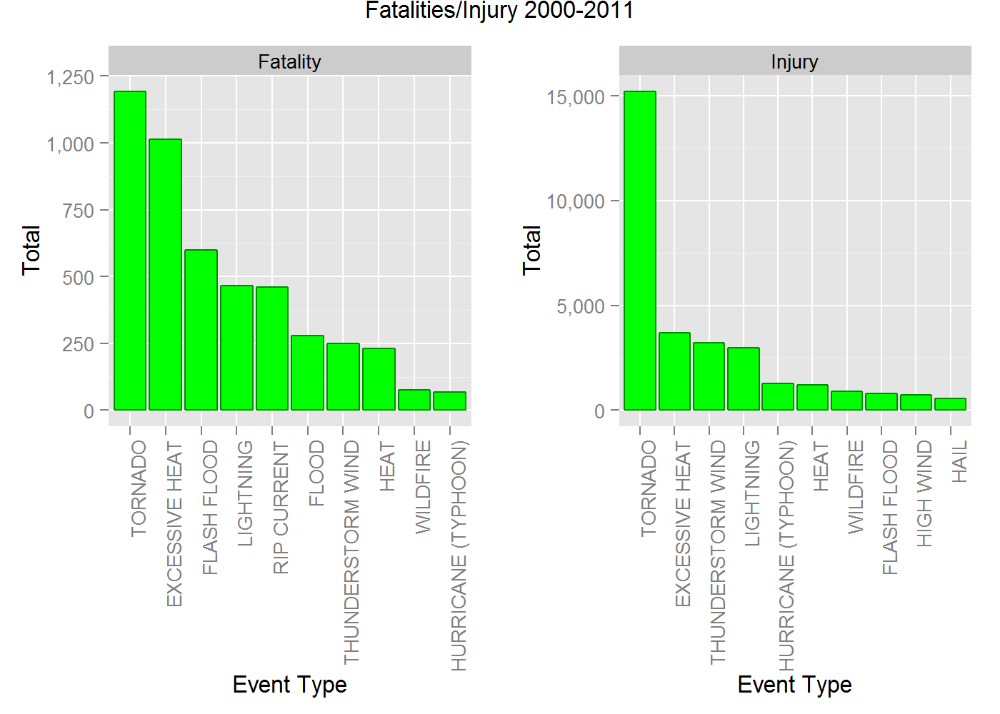

# Reproducible Research Storm Data
Eddie Warner  


## Synopsis:

  
This data analysis will explore the NOAA Storm Database in order to answer questions about severe weather events. This report will look at which weather types of most harmful to populations effected. In addition, event types will be analyzed for economic costs.

Since events recorded have changed and coding for events have changed this study will look at the events from 2000 - 2011. The data from this period appears to be more consistent. After 1996 48 event types where used to code the events. See [@NOAA_events] in the reference section below. But it is clear from the data that alternate codes are still in use. (see Event Type Column) 

## Data Processing


```r
file.name <- "repdata-data-StormData.csv.bz2"
file.url <- "https://d396qusza40orc.cloudfront.net/repdata%2Fdata%2FStormData.csv.bz2"

if(!file.exists(file.name)) {
    download.file(url = file.url, destfile = file.name)
}

storm_data <- as.data.table(read.csv(file.name, stringsAsFactors=FALSE, strip.white=TRUE))
```
### Data set facts


```r
dim(storm_data)
```

```
## [1] 902297     37
```

```r
summary(storm_data$EVTYPE, storm_data$BGN_DATE, storm_data$EVTYPE, storm_data$FATALITIES, storm_data$INJURIES, storm_data$PROPDMG, storm_data$PROPDMGEXP, storm_data$CROPDMG, storm_data$CROPDMGEXP)
```

```
##    Length     Class      Mode 
##    902297 character character
```

```r
head(storm_data)
```

```
##    STATE__           BGN_DATE BGN_TIME TIME_ZONE COUNTY COUNTYNAME STATE
## 1:       1  4/18/1950 0:00:00     0130       CST     97     MOBILE    AL
## 2:       1  4/18/1950 0:00:00     0145       CST      3    BALDWIN    AL
## 3:       1  2/20/1951 0:00:00     1600       CST     57    FAYETTE    AL
## 4:       1   6/8/1951 0:00:00     0900       CST     89    MADISON    AL
## 5:       1 11/15/1951 0:00:00     1500       CST     43    CULLMAN    AL
## 6:       1 11/15/1951 0:00:00     2000       CST     77 LAUDERDALE    AL
##     EVTYPE BGN_RANGE BGN_AZI BGN_LOCATI END_DATE END_TIME COUNTY_END
## 1: TORNADO         0                                               0
## 2: TORNADO         0                                               0
## 3: TORNADO         0                                               0
## 4: TORNADO         0                                               0
## 5: TORNADO         0                                               0
## 6: TORNADO         0                                               0
##    COUNTYENDN END_RANGE END_AZI END_LOCATI LENGTH WIDTH F MAG FATALITIES
## 1:         NA         0                      14.0   100 3   0          0
## 2:         NA         0                       2.0   150 2   0          0
## 3:         NA         0                       0.1   123 2   0          0
## 4:         NA         0                       0.0   100 2   0          0
## 5:         NA         0                       0.0   150 2   0          0
## 6:         NA         0                       1.5   177 2   0          0
##    INJURIES PROPDMG PROPDMGEXP CROPDMG CROPDMGEXP WFO STATEOFFIC ZONENAMES
## 1:       15    25.0          K       0                                    
## 2:        0     2.5          K       0                                    
## 3:        2    25.0          K       0                                    
## 4:        2     2.5          K       0                                    
## 5:        2     2.5          K       0                                    
## 6:        6     2.5          K       0                                    
##    LATITUDE LONGITUDE LATITUDE_E LONGITUDE_ REMARKS REFNUM
## 1:     3040      8812       3051       8806              1
## 2:     3042      8755          0          0              2
## 3:     3340      8742          0          0              3
## 4:     3458      8626          0          0              4
## 5:     3412      8642          0          0              5
## 6:     3450      8748          0          0              6
```

### Data conversion

#### Date
Convert BGN_DATE to a date column to allow for time calculations.

#### Columns
To answer questions implicit to the study the following columns will be selected from the data set (BGN_DATE EVTYPE FATALITIES, INJURIES, PROPDMG, PROPDMGEXP, CROPDMG, CROPDMGEXP). The data set column names are not explicitly listed within either reference documents provided, but appear to be self explanatory.

#### Damage Exponent
Damage exponent are considered as ("K", "M", "B") thousands, millions and billions.

Create a factor for the cost extension to convert to four levels c("","K", "M", "B").
Calculate a total damage summation between crop damage and infrastructure damage.


```r
# bgn_date as date
sel_storm_data_date  <- storm_data %>% 
    mutate(BGN_DATE = mdy_hms(BGN_DATE)) %>%
    filter(BGN_DATE >= ymd("2000/01/01"))

# columns and date 
sel_storm_data_fn <- sel_storm_data_date %>% 
    select(BGN_DATE, EVTYPE, FATALITIES, INJURIES, PROPDMG, PROPDMGEXP, CROPDMG, CROPDMGEXP)
rm(sel_storm_data_date)
# create factors
sel_storm_data_fn$PROPDMGEXP <- factor(sel_storm_data_fn$PROPDMGEXP, levels=c("","K", "M", "B"))
sel_storm_data_fn$CROPDMGEXP <- factor(sel_storm_data_fn$CROPDMGEXP, levels=c("","K", "M", "B"))
# start cleaning event type
sel_storm_data_fn <- sel_storm_data_fn %>% 
    mutate(EVTYPE = toupper(EVTYPE)) 
# some events have white space
sel_storm_data_fn$EVTYPE <- str_trim(sel_storm_data_fn$EVTYPE)
# create a factor
sel_storm_data_fn$EVTYPE <- factor(sel_storm_data_fn$EVTYPE)
# dictionary exp
exp_num <- c(1, 1000, 1000000, 1000000000)
names(exp_num) <- c("","K", "M", "B")

# calculate damage
sel_storm_data_fn <- sel_storm_data_fn %>% mutate(PROPTOT = exp_num[PROPDMGEXP] * PROPDMG)
sel_storm_data_fn <- sel_storm_data_fn %>% mutate(CROPTOT = exp_num[CROPDMGEXP] * CROPDMG)
sel_storm_data_fn <- sel_storm_data_fn %>% mutate(DAMAGETOT = PROPTOT + CROPTOT)
# calculate harm
sel_storm_data_fn <- sel_storm_data_fn %>% mutate(FATINJTOT = FATALITIES + INJURIES)
```

#### Event Type Column (EVTYPE)

The event types in the data set are not consistent. For this analysis, the event types for the period will be saved in order to create a manual map to the 48 codes in use since 1996. [see @10_1605]  Even through the study will use data after 2000, and that data should use the 48 codes, EVTYPE still has 196 levels. 

The strategy to map names will be to map when there is a clear mapping (WINTER WEATHER MIX <-> Winter Weather) but to leave ambiguous mappings alone (OTHER <-> OTHER). Although this mapping may introduce some error, since the main weather events (tornado, hurricane, flood etc.) are so large this error will not affect the analysis.


```r
file.name.csv <- "events_raw.csv"
file.name.mapped <- "events_mapped.csv"

# write out event names
if(!file.exists(file.name.csv)) {
    events <- sort(levels(sel_storm_data_fn$EVTYPE))
    write.table(as.data.table(events), file = file.name.csv, row.names = FALSE)
}

# read the mapped values back in
event_types_mapped <- read.table(file.name.mapped, stringsAsFactors = FALSE)
names(event_types_mapped) <- c("event_name", "event_name_mapped")

event_types_mapped <- event_types_mapped %>% 
    mutate(event_name_mapped = toupper(event_name_mapped))
# creaete a replacement map.
replace <- as.character(event_types_mapped$event_name_mapped)
names(replace) <- as.character(event_types_mapped$event_name)
# create a copy of EVTYPE so we can check our work.
sel_storm_data_fn <- sel_storm_data_fn %>% mutate(EVTYPEMAP = EVTYPE)
# map to cleaned up codes using revalue from plyr
sel_storm_data_fn$EVTYPEMAP <- revalue(sel_storm_data_fn$EVTYPEMAP, replace = replace)
```

For injury and death, group by event and sum each category. Reshape data so injury and death can be plotted against one another. Data has been reshaped to allow for better visualization. 


```r
# get rows that record injury
injury <- sel_storm_data_fn %>% 
    filter(INJURIES > 0) %>% 
    group_by(EVTYPEMAP) %>% 
    summarise(TOTAL = sum(INJURIES, na.rm = TRUE), FATINJTOT = sum(FATINJTOT, na.rm = TRUE)) %>%
    mutate(HRMTYPE = "Injury")
# get rows that record death
death <- sel_storm_data_fn %>% 
    filter(FATALITIES > 0) %>%
    group_by(EVTYPEMAP) %>% 
    summarise(TOTAL = sum(FATALITIES, na.rm = TRUE), FATINJTOT = sum(FATINJTOT, na.rm = TRUE)) %>%
    mutate(HRMTYPE = "Fatality")
# rebind
pop_inj_death_total <- rbind(injury, death)
pop_inj_death_total$HRMTYPE <- factor(pop_inj_death_total$HRMTYPE)

pop_inj_death_total <- pop_inj_death_total %>%  
    group_by(HRMTYPE) %>%
    arrange(desc(TOTAL)) %>% 
    top_n(10, wt = FATINJTOT)
# get the combined total
```

For property and crop damage, group by event and sum each category. Reshape data so property and crop damage can be plotted against one another. Data has been reshaped to allow for better visualization. 


```r
# get rows that record property damage
property <- sel_storm_data_fn %>% 
    filter(PROPTOT > 0) %>% 
    group_by(EVTYPEMAP) %>% 
    summarise(TOTAL = sum(PROPTOT, na.rm = TRUE), DAMAGETOT = sum(DAMAGETOT, na.rm = TRUE)) %>%
    mutate(DMGTYPE = "Property DMG") 

# get rows that record crop damage
crop <- sel_storm_data_fn %>% 
    filter(CROPTOT > 0) %>% 
    group_by(EVTYPEMAP) %>% 
    summarise(TOTAL = sum(CROPTOT, na.rm = TRUE), DAMAGETOT = sum(DAMAGETOT, na.rm = TRUE)) %>% 
    mutate(DMGTYPE = "Crop DMG")

# rebind
prop_damage_by_total <- rbind(property, crop)
prop_damage_by_total$DMGTYPE <- factor(prop_damage_by_total$DMGTYPE)

prop_damage_by_year <- sel_storm_data_fn %>% 
    mutate(YEAR = format(BGN_DATE, "%Y")) %>%
    group_by(EVTYPEMAP, YEAR) %>% 
    summarise(PROPTOT = sum(PROPDMG, na.rm = TRUE), CROPTOT = sum(CROPDMG, na.rm = TRUE), DAMAGETOT = sum(PROPDMG + CROPDMG), na.rm = TRUE)


prop_damage_by_total <- prop_damage_by_total %>%  
    group_by(DMGTYPE) %>%
    arrange(desc(TOTAL)) %>% 
    top_n(10, wt=DAMAGETOT) 

prop_damage_by_year$YEAR <- factor(prop_damage_by_year$YEAR)
```


## Results

For the period after the year 2000 the following caused the most damage to crops or infrastructure.

### Plots and Analysis

#### Economic Cost

The plots below show the 10 most damaging events for property and crops. Some interesting facts emerge showing that drought would be most expensive for crop damage. Storm surge/tide effects only property since there are not many farms right on the beach. Flood and hurricane cause the most property damage while drought and flood cause the most crop damage.


```r
pd <- prop_damage_by_total %>% filter(DMGTYPE == "Property DMG")
cd <- prop_damage_by_total %>% filter(DMGTYPE == "Crop DMG")
#prop_damage_plot <- ggplot(prop_damage_by_total, aes(x = reorder(EVTYPEMAP, -TOTAL) , y=TOTAL))
prop_damage_plot <- ggplot(pd, aes(x = reorder(EVTYPEMAP, -TOTAL)  , y=TOTAL/10^6)) 
prop_damage_plot <- prop_damage_plot + geom_bar(stat="identity", col="green4", fill="green")
prop_damage_plot <- prop_damage_plot + facet_grid(~DMGTYPE,  scales = "free") 
prop_damage_plot <- prop_damage_plot + labs(x = "Event Type")
prop_damage_plot <- prop_damage_plot + scale_y_continuous(name="Total Damage In Millions", labels = comma)
prop_damage_plot <- prop_damage_plot + theme(axis.text.x = element_text(angle = 90, hjust = 1, vjust=1))

crop_damage_plot <- prop_damage_plot %+% cd

grid.arrange(prop_damage_plot, crop_damage_plot, nrow=1, main = "Economic Damage" )
```


The plot above shows total damage broken out by property and corp damage.  

#### Fatality and Injury

As opposed to economic cost differences between crop damage and property damage, injuries and fatalities generally track for weather events. Tornado and excessive heat cause the most injury and death.


```r
fat <- pop_inj_death_total %>% filter(HRMTYPE == "Fatality")
inj <- pop_inj_death_total %>% filter(HRMTYPE == "Injury")
#prop_damage_plot <- ggplot(prop_damage_by_total, aes(x = reorder(EVTYPEMAP, -TOTAL) , y=TOTAL))
fat_damage_plot <- ggplot(fat, aes(x = reorder(EVTYPEMAP, -TOTAL)  , y=TOTAL)) 
fat_damage_plot <- fat_damage_plot + geom_bar(stat="identity", col="green4", fill="green")
fat_damage_plot <- fat_damage_plot + facet_grid(~HRMTYPE,  scales = "free") 
fat_damage_plot <- fat_damage_plot + labs(x = "Event Type")
fat_damage_plot <- fat_damage_plot + scale_y_continuous(name="Total", labels = comma)
fat_damage_plot <- fat_damage_plot + theme(axis.text.x = element_text(angle = 90, hjust = 1, vjust=1))

inj_damage_plot <- fat_damage_plot %+% inj
inj_damage_plot <- inj_damage_plot + facet_grid(~HRMTYPE,  scales = "free_x") 

grid.arrange(fat_damage_plot, inj_damage_plot, nrow=1, main = "Fatalities/Injury 2000-2011" )
```



The plot above shows total fatalities and injuries for weather events.  


